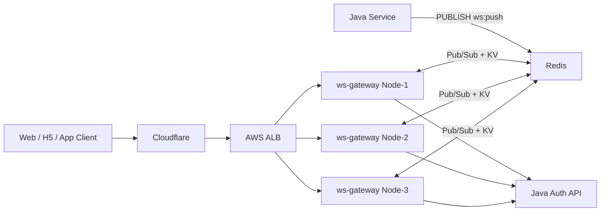
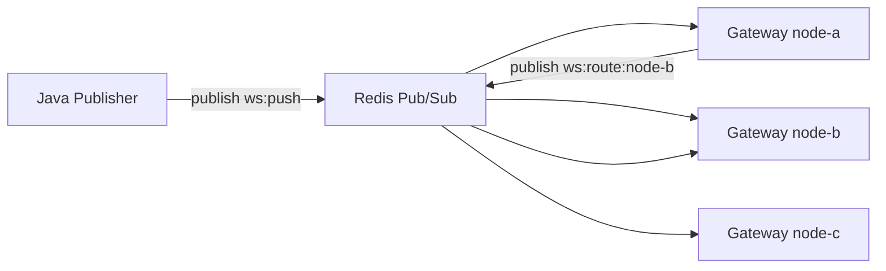
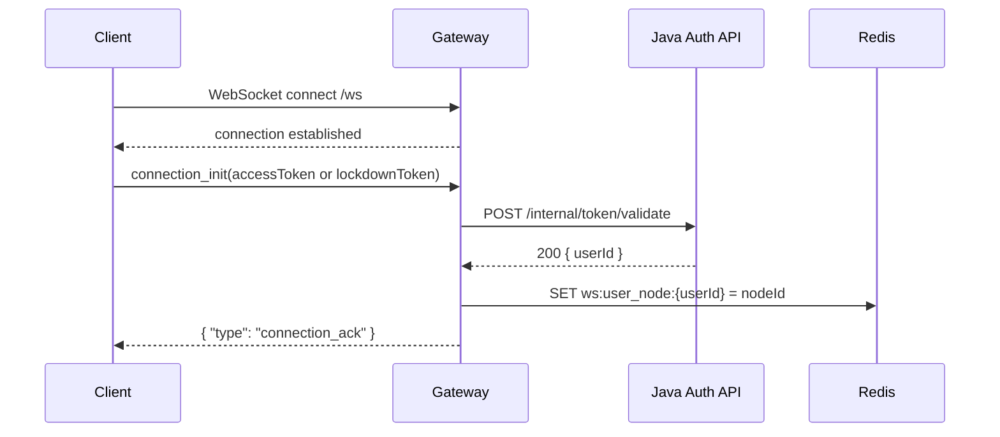
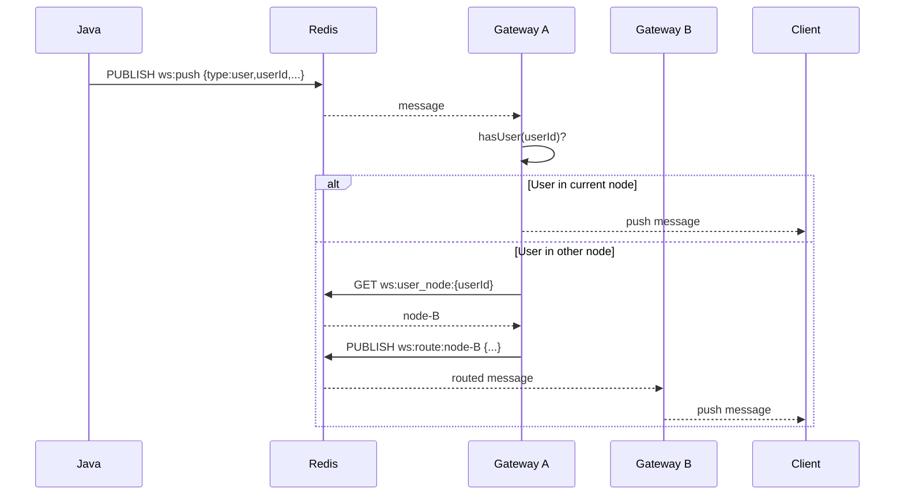
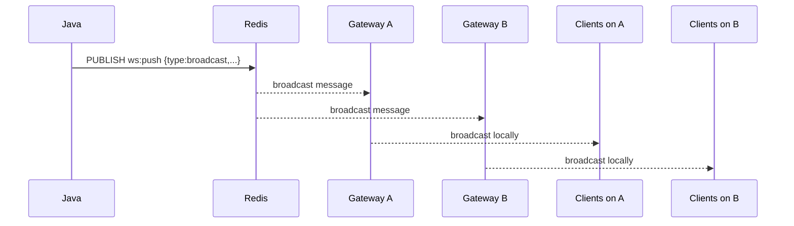
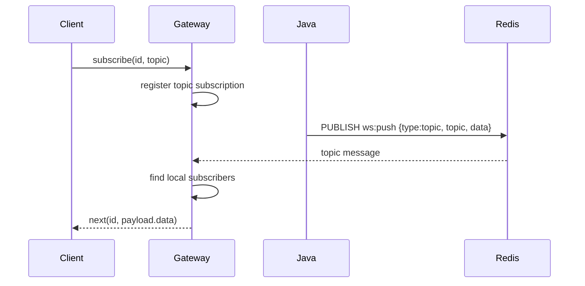
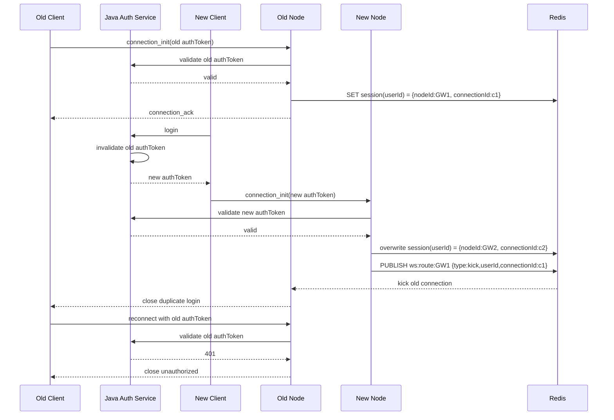
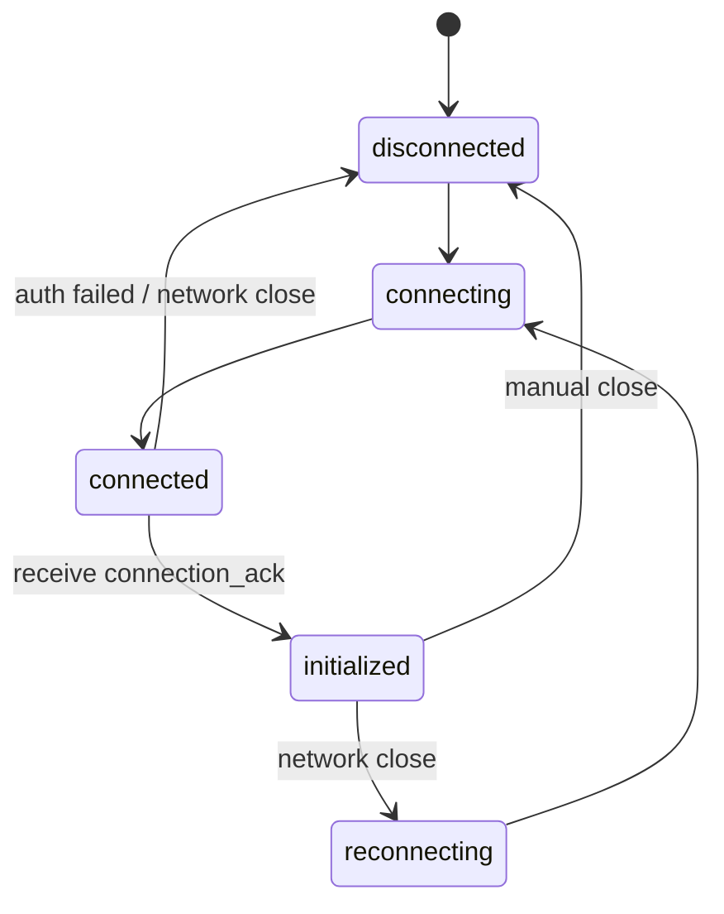
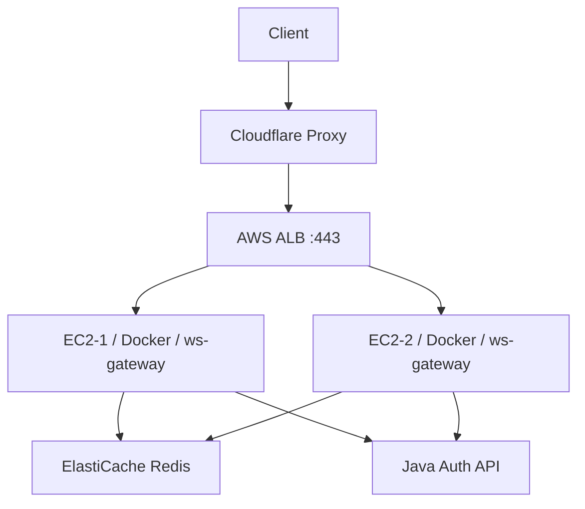
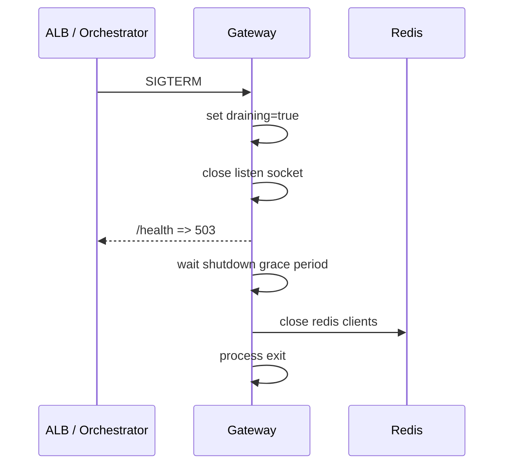

# WS Gateway 技术方案

面向对象：

- 前端 Leader：关注连接协议、订阅模型、重连与心跳策略、接入成本
- 后端 Leader：关注系统边界、消息入口、鉴权、路由、部署方式、容量与风险

## 1. 背景与目标

`ws-gateway` 是一个面向业务推送场景的 WebSocket 网关，用于承接来自 Java 服务端的实时消息，并将消息转发到在线客户端。

在这套方案里，Redis 不是一个“普通缓存”，而是整个网关横向扩展能力的核心基础设施，承担两类关键职责：

- 记录 `userId -> nodeId` 的在线路由映射，解决“目标用户当前连在哪个网关节点上”的问题
- 通过 Pub/Sub 让多节点网关共享入口消息与节点间转发消息，解决“多实例下消息如何送达正确节点”的问题

当前方案选择：

- 网关协议层：WebSocket
- 实时消息入口：Redis Pub/Sub
- 节点间路由：Redis Pub/Sub
- 用户在线路由表：Redis Key/Value
- 鉴权来源：Java HTTP 接口
- 部署形态：多节点横向扩展

本方案的核心目标：

- 对前端提供稳定、清晰、低耦合的实时通信协议
- 对后端提供简单直接的消息投递入口
- 支持多实例水平扩展
- 支持用户级单播、全局广播、topic 订阅推送
- 保持系统实现简单，适配当前“在线尽力投递”的业务阶段

本方案明确不覆盖：

- 离线消息补发
- 消息持久化重放
- 严格消费确认与重试
- 顺序消费保证

## 1.1 给 Leader 的评审摘要

这部分不是技术细节，而是本次方案希望前后端 Leader 共同确认的核心事项。

### 前端 Leader 需要重点确认什么

前端侧本次需要确认的不是“能不能接”，而是“接入边界是否可接受”。

需要确认的核心点：

- 客户端协议是否接受 `connection_init / subscribe / complete / ping`
- 登录态与游客态是否统一走 `connection_init`
- 客户端是否接受“必须自己做自动重连和恢复订阅”
- topic 命名是否稳定，是否可以作为长期协议字段
- 是否接受当前为“在线连接实时推送”，不提供离线补发

对前端的直接影响：

- 接入复杂度整体较低
- 需要实现一个稳定的 WebSocket 连接管理器
- 需要具备心跳、重连、重放订阅能力
- 页面业务层不需要关心网关节点数量与部署拓扑

### 后端 Leader 需要重点确认什么

后端侧本次需要确认的不是“Redis 能不能发消息”，而是“这套消息模型是否符合当前业务阶段”。

需要确认的核心点：

- Java 是否接受统一向 Redis `ws:push` 发布消息
- 鉴权是否统一走 Java token validate 接口
- 是否接受 Redis 既承担在线路由表，又承担多节点消息总线
- 是否接受单端登录场景下由认证系统使旧 `authToken` 失效
- 是否接受当前消息模型为“在线尽力投递”，而不是可靠消息
- 是否接受后续若要支持离线补发，再演进 Streams / MQ

对后端的直接影响：

- Java 接入成本低，只需发布 JSON 到 Redis
- 不需要 Java 自己维护长连接
- 需要明确业务上哪些消息可以丢，哪些未来必须升级为可靠消息

### 本次评审真正要拍板的决策

建议 Leader 评审时直接围绕下面 6 个问题做结论：

1. 是否接受 Redis 作为当前阶段的中心组件，同时承担路由表和 Pub/Sub 总线
2. 是否接受当前阶段采用“在线尽力投递”，而非可靠消息投递
3. 是否接受前端必须实现自动重连、心跳和订阅恢复
4. 是否接受 token 鉴权统一由 Java 提供 HTTP 接口
5. 是否接受单端登录下由认证系统让旧 `authToken` 过期
6. 是否接受网关层引入 `connectionId` 以避免旧连接误删 Redis 在线状态
7. 是否接受部署形态为 Cloudflare + ALB + 多节点 ws-gateway + Redis
8. 是否接受后续按业务需要再演进到 Redis Streams 或 MQ

### 如果 Leader 只看一段结论

这套方案的核心价值是：

- 对前端，协议统一、接入简单、节点拓扑透明
- 对后端，消息入口简单、网关职责清晰、易于横向扩展
- 对系统整体，能以较低复杂度支撑当前阶段的实时推送需求

这套方案的核心代价是：

- 当前不是可靠消息系统
- Redis 是中心依赖
- 前端必须承担连接稳定性的最后一环

## 2. 技术选型说明

这部分提前说明，是因为当前架构是否合理，核心就在于对 Redis 的使用方式是否符合业务阶段。

### 2.1 为什么 Redis 是当前架构的中心

当前网关要解决的不是“单机 WebSocket 怎么写”，而是“多节点下，消息怎么找到正确连接”。

这里有两个基础问题必须先解决：

1. 某个用户连接到了哪台网关节点
2. 一条后端消息进入系统后，所有网关节点如何协同处理

Redis 正好对应解决这两个问题：

- 用 Key/Value 存 `userId -> nodeId`
- 用 Pub/Sub 做多节点消息传播

也就是说，Redis 在本方案里同时承担：

- 在线路由表
- 入口消息总线
- 节点间转发总线

这也是整个设计能够在多节点下成立的关键。

### 2.2 为什么选择 `userId -> nodeId` 映射

当 Java 发送一条“推给用户 A”的消息时，系统必须知道：

- 用户 A 是否在线
- 如果在线，他连在哪个节点

如果没有这层映射，就只能：

- 所有节点都尝试推一次，造成无效广播
- 或者强依赖负载均衡 sticky session，但这仍不能解决消息入口随机落在任意节点的问题

所以这里采用：

- 用户连接成功后，网关写入 `ws:user_node:{userId} = {nodeId}`
- 用户最后一个连接断开后，删除该映射
- 映射带 TTL，用于降低脏数据长期残留风险

这样任意节点在收到用户消息时，都能先查 Redis，再决定：

- 本节点直接推
- 转发到目标节点
- 用户离线则直接丢弃

### 2.3 为什么选择 Redis Pub/Sub 支撑多节点

多节点网关场景下，Java 不应该关心：

- 当前有几台网关实例
- 某个用户在哪台机器
- 某个 topic 的订阅者分布在哪些节点

所以消息入口必须足够简单。

当前方案里，Java 只需要：

- 向 Redis `ws:push` 发布一条 JSON 消息

然后由所有网关节点共同订阅这个入口 channel，各自执行本地处理逻辑。

Redis Pub/Sub 在这里提供了两个层面的多节点支持：

1. `ws:push`
   所有网关节点都订阅，任何一个后端服务发布消息后，所有节点都能同时收到

2. `ws:route:{nodeId}`
   某个节点在发现目标用户不在本机时，只把消息转发到指定节点的专属 channel

这套模式保证了：

- 广播消息天然扇出到所有网关节点
- 用户定向消息可以通过“查路由表 + 定向 channel”落到正确节点
- topic 消息可以由每个节点只推送本节点订阅者

### 2.4 为什么当前不选 MQ / Kafka / Redis Streams

不是这些方案不能做，而是当前阶段没有必要先把复杂度拉高。

当前业务阶段更需要的是：

- 快速接入
- 实现简单
- 横向扩展
- 实时在线推送

而不是：

- 消息持久化
- 消费位点管理
- 失败重试
- 历史重放

所以 Redis Pub/Sub 是当前阶段的最优解之一。

它的代价也非常明确：

- 在线尽力投递
- 实例不在线时消息可能丢失
- 不具备可靠消息语义

这个取舍必须在评审阶段先讲清楚，而不是在落地之后再补充说明。

## 3. 总体架构



一句话概括：

- Java 负责“生产消息”
- ws-gateway 负责“鉴权、连接管理、消息分发、节点间转发”
- Redis 负责“消息入口、节点通信、在线路由表”
- 前端负责“连接、心跳、订阅、重连”

## 4. 组件职责划分

### 4.1 Java 服务

职责：

- 调用业务逻辑产出推送事件
- 向 Redis `ws:push` 发布 JSON 消息
- 提供 token 鉴权接口给 ws-gateway 调用

不负责：

- WebSocket 长连接维护
- 多节点路由
- 前端订阅状态维护

### 4.2 ws-gateway

职责：

- 接收 WebSocket 连接
- 校验 `accessToken` 或 `lockdownToken`
- 维护本节点连接表与订阅表
- 从 Redis 订阅入口消息
- 按消息类型执行广播、用户定向推送或 topic 推送
- 用户不在本节点时执行跨节点转发

### 4.3 Redis

职责：

- `ws:push`：网关统一入口消息通道
- `ws:route:{nodeId}`：节点定向转发通道
- `ws:user_node:{userId}`：用户所在节点映射

边界：

- 当前仅承担实时分发，不承担可靠消息存储

### 4.4 Redis 在线路由映射说明

Redis 中保存的核心路由数据：

```text
ws:user_node:{userId} -> {nodeId}
```

例如：

```text
ws:user_node:user-1 -> node-a
ws:user_node:user-2 -> node-c
```

它的作用是回答一个最关键的问题：

- “某个用户当前连接在哪个网关节点上？”

写入时机：

- 用户完成 `connection_init` 并鉴权成功后写入

删除时机：

- 用户最后一个连接断开后删除

补充机制：

- 设置 TTL，避免节点异常退出时脏映射永久残留

这层映射存在后，网关集群就能实现真正的用户定向推送，而不需要依赖 sticky session 或全节点广播。

但如果系统需要支持“单端登录 / 互踢”，仅有 `userId -> nodeId` 还不够。

原因是：

- 新连接可能已经覆盖 Redis 中的在线节点
- 旧连接随后关闭时，如果仍然直接删除 `ws:user_node:{userId}`
- 就会把新连接刚写入的在线状态误删

因此在单端登录场景下，建议将在线路由从“节点映射”升级为“会话所有权映射”。

建议结构：

```text
ws:user_session:{userId} -> {nodeId, connectionId}
```

例如：

```json
{
  "nodeId": "node-b",
  "connectionId": "conn-9f2c",
  "connectedAt": 1710000000
}
```

这里的 `connectionId` 用于解决两个问题：

- 哪个连接才是这个用户当前真实有效的连接
- 旧连接关闭时，是否有资格删除 Redis 中的在线状态

也就是说：

- `userId -> nodeId` 解决“消息该路由到哪个节点”
- `userId -> {nodeId, connectionId}` 解决“这个路由状态当前归谁所有”

### 4.5 Redis Pub/Sub 多节点机制说明

在本方案里，多节点协同完全依赖 Redis Pub/Sub。

核心 channel 分为两类：

- 入口 channel：`ws:push`
- 节点路由 channel：`ws:route:{nodeId}`

工作方式如下：



解释：

- Java 发到 `ws:push` 后，所有网关节点都会收到
- 每个节点根据消息类型，决定是本地广播、本地 topic 推送，还是查路由表后转发
- 如果需要定向转发，则向目标节点的专属 channel 发布消息
- 只有对应节点会消费该定向消息

这就是当前多节点架构可以成立的根本原因。

在单端登录场景下，这套 Pub/Sub 机制还可以承担“互踢控制消息”的跨节点传递。

例如：

- 新连接在 `node-b`
- 旧连接还在 `node-a`
- 当认证系统确认旧 token 已失效后，网关可向 `ws:route:node-a` 发布内部踢线消息
- `node-a` 只关闭匹配 `connectionId` 的旧连接

这样就能在多节点场景下完成互踢，而不需要节点之间直连。

## 5. 核心数据流

### 5.1 连接与鉴权流程



要点：

- 握手阶段不做认证，避免把业务鉴权逻辑塞进 Upgrade 阶段
- 认证成功后才将连接纳入本节点管理
- 用户上线后写入 Redis 路由表，供后续用户定向推送使用

### 5.2 用户消息流程



要点：

- 任意节点都可能收到入口消息
- 当前节点若无目标用户，则查 Redis 找目标节点
- 真正的用户定向推送通过 `ws:route:{nodeId}` 完成

### 5.3 广播消息流程



要点：

- 广播消息不需要查用户路由表
- 每个网关节点都对自己持有的在线连接执行本地广播

### 5.4 Topic 订阅消息流程



要点：

- 订阅状态只保存在网关节点内存中
- 客户端 `subscribe` 时提交 `id`
- 后续网关推送 `next` 时复用该 `id`
- 当前 topic 推送是“所有节点各自推给本节点订阅者”

### 5.5 单端登录与互踢流程

这一节是单端登录场景下的关键设计，建议前后端 Leader 一起重点评审。

系统目标：

- 同一用户只允许保留一个有效登录端
- 新登录成功后，旧连接必须失去继续重连的资格
- 多节点情况下不能因为旧连接关闭而误删新连接的 Redis 在线状态

关键原则：

- “谁失效”由认证系统决定
- “谁断连接”由网关执行
- “谁能删除 Redis 在线状态”由 `connectionId` 所有权决定

流程如下：



这套流程里有两个缺一不可的保证：

1. 旧 `authToken` 必须失效  
   否则旧客户端会在被踢后继续自动重连，并重新抢占连接

2. Redis 在线状态必须带 `connectionId`  
   否则旧连接在关闭时，可能把新连接刚写入的在线状态误删

### 5.6 单端登录下的 Redis 状态更新原则

为了避免互踢过程中的竞态问题，Redis 状态更新建议遵循以下规则：

#### 写入规则

- 新连接鉴权成功后生成唯一 `connectionId`
- 将 `ws:user_session:{userId}` 更新为最新 `{nodeId, connectionId}`

#### 删除规则

- 连接关闭时，不能直接删除 `ws:user_session:{userId}`
- 必须先判断 Redis 当前记录的 `connectionId` 是否仍然等于自己
- 只有自己仍然是当前 owner，才允许删除

这本质上是 compare-and-delete：

- 如果 Redis 里已经是新连接的 `connectionId`
- 旧连接就没有资格删 Redis

#### 节点内存规则

单端模型下，节点内存结构也建议收敛为：

```text
userId -> { connectionId, ws }
```

而不是：

```text
userId -> Set<WebSocket>
```

这样才能精确执行：

- 定位当前真实连接
- 关闭指定旧连接
- 避免多个连接并存时状态不一致

## 6. 前端接入协议

### 6.1 连接初始化

客户端连接后必须首先发送：

```json
{
  "type": "connection_init",
  "payload": {
    "accessToken": "token-for-login-user"
  }
}
```

或：

```json
{
  "type": "connection_init",
  "payload": {
    "lockdownToken": "token-for-guest-user"
  }
}
```

服务端返回：

```json
{ "type": "connection_ack" }
```

约束：

- 未收到 `connection_ack` 之前，前端不应发送订阅等业务消息
- 未发送 `connection_init` 时发送其他消息，会被直接关闭连接

### 6.2 订阅协议

客户端发送：

```json
{
  "id": "uuid",
  "type": "subscribe",
  "payload": "ws.available-balances"
}
```

服务端推送：

```json
{
  "id": "uuid",
  "type": "next",
  "payload": {
    "data": {
      "amount": 100,
      "currency": "USD"
    }
  }
}
```

取消订阅：

```json
{
  "id": "uuid",
  "type": "complete"
}
```

### 6.3 心跳与重连建议

前端建议：

- 每 30-60 秒发送一次 `ping`
- 服务端返回 `pong`
- 连接断开后执行自动重连
- 重连成功后自动重发 `connection_init`
- 重连成功并收到 `connection_ack` 后恢复业务订阅

推荐前端状态机：



## 7. 后端消息协议

### 7.1 用户消息

```json
{
  "type": "user",
  "userId": "user-1",
  "event": "balance_update",
  "data": {
    "balance": 999
  }
}
```

### 7.2 广播消息

```json
{
  "type": "broadcast",
  "event": "announcement",
  "data": {
    "text": "hello"
  }
}
```

### 7.3 Topic 消息

```json
{
  "type": "topic",
  "topic": "ws.available-balances",
  "data": {
    "amount": 100,
    "currency": "USD"
  }
}
```

## 8. 部署方案

当前推荐生产拓扑：



建议配置：

- Cloudflare 代理 WebSocket
- AWS 使用 ALB，而非 NLB，便于统一处理 HTTP + WebSocket + `/health`
- 多个 ws-gateway 节点横向扩展
- Redis 建议使用托管版主从架构

## 8.1 健康检查与优雅停机

网关当前提供：

- `/health`：反映服务整体状态和 Redis 可用性
- `/ready`：反映就绪状态，适合摘流量场景

停机流程：



价值：

- 避免新连接继续进入正在退出的实例
- 给现有连接一定缓冲时间
- 让负载均衡及时摘除实例

## 9. 补充选型说明

### 9.1 为什么选 WebSocket Gateway

原因：

- 浏览器 / App 端原生兼容
- 服务端可统一维护连接、鉴权、订阅、推送协议
- Java 业务侧不需要直接处理大量长连接

### 9.2 为什么选 Redis Pub/Sub

当前阶段优点：

- 实现简单
- Java 侧接入成本低
- 节点扩容容易
- 用户路由和消息分发可统一依赖 Redis

明确代价：

- 消息不持久化
- 订阅者不在线就会丢消息
- 实例短时断连可能漏消息
- 不适合需要严格可靠投递的场景

结论：

- 对“在线实时推送”足够合适
- 若后续需要可靠消息，再演进 Redis Streams / Kafka / MQ

### 9.3 为什么不在现阶段上 Redis Streams

原因不是不能，而是不必要：

- 当前需求更偏“在线消息实时送达”
- 业务价值重点在低延迟和简单接入，而不是消息重放
- Streams 会引入消费位点、积压管理、重试语义等复杂度

这是一种阶段性取舍，不是能力上限。

## 10. 常见问题与解决方案

### 10.1 为什么客户端连上了却收不到消息

常见原因：

- 没有发送 `connection_init`
- `connection_init` 未通过鉴权
- 客户端还没收到 `connection_ack`
- 消息类型不对，例如订阅后发了 `broadcast`，但期望的是 `topic`
- `topic` 名称不在支持列表中
- 发布的 `userId` 与当前连接用户标识不一致

排查建议：

- 先看 demo 或客户端是否进入 `Initialized`
- 再看 gateway 日志是否输出 user initialized
- 再看 Redis 发布的 JSON 是否符合协议

### 10.2 为什么 topic 消息没有推到所有客户端

因为 topic 推送不是全局广播，而是：

- 只推给“订阅了该 topic”的连接
- 每个网关节点只推自己本地内存里的订阅者

所以必须同时满足：

- 客户端已成功订阅
- topic 名字合法
- 推送时使用 `type=topic`

### 10.3 为什么用户消息会丢

这是当前架构的已知边界：

- 如果用户离线，消息直接丢弃
- 如果 Redis Pub/Sub 发布时目标节点短暂不可用，消息可能丢失
- 如果业务要求离线补发，当前方案不覆盖

解决方向：

- 若只是弱一致在线消息，保持现状
- 若要求可靠性，演进为 Streams / MQ

### 10.4 为什么需要前端自己做自动重连

因为实际生产环境中：

- Cloudflare 可能因边缘重启断开连接
- ALB / 网络波动也会导致连接中断
- WebSocket 长连接天然不是永久稳定连接

所以自动重连是客户端必备能力，不应由网关“假设永不断线”。

### 10.5 为什么登录态和游客态都走 `connection_init`

这样做的价值是统一协议：

- 已登录用户使用 `accessToken`
- 游客用户使用 `lockdownToken`
- 网关只需要处理一个初始化消息入口
- Java 鉴权接口也可以统一收口

### 10.6 Redis 会不会成为单点

会，所以生产上不建议单机 Redis。

建议：

- 使用 ElastiCache 托管 Redis
- 至少主从 + 自动故障转移
- 网关实例跨可用区部署

### 10.7 为什么互踢不能只靠关闭旧连接

因为只关闭旧连接，并不能阻止旧客户端重新连回来。

如果旧 `authToken` 仍然有效，就会出现：

- 新连接登录成功
- 旧连接被踢下线
- 旧客户端自动重连
- 旧 token 再次鉴权通过
- 两端重新竞争在线状态

所以单端登录真正的关键不是“踢掉 socket”，而是：

- 认证系统让旧 `authToken` 失效
- 网关负责把旧连接断开

这样旧客户端后续即使自动重连，也会因为鉴权失败而被拒绝。

### 10.8 为什么 Redis 在线状态必须带 `connectionId`

因为单端登录场景下，旧连接关闭的时间可能晚于新连接完成登录的时间。

如果 Redis 里只存：

```text
userId -> nodeId
```

就会出现典型竞态：

- 新连接把在线状态更新成新节点
- 旧连接随后触发 close
- 旧连接直接删除 Redis key
- 新连接在线状态被误删

所以必须引入：

```text
userId -> { nodeId, connectionId }
```

删除时只允许当前 owner 删除自己的状态。

## 11. 风险清单

| 风险 | 说明 | 当前策略 | 后续演进 |
|------|------|----------|----------|
| 消息丢失 | Pub/Sub 非持久化 | 业务接受“在线尽力投递” | Redis Streams / Kafka |
| 节点重启导致连接断开 | 长连接天然会断 | 前端自动重连 + 恢复订阅 | 更完善的客户端 SDK |
| Redis 故障影响全局消息 | Redis 是中心依赖 | 健康检查 + 托管 Redis | 高可用 Redis |
| topic 状态仅在内存 | 实例重启会丢订阅 | 客户端重连后恢复订阅 | 服务端持久化订阅模型 |
| 路由表过期或脏数据 | userId -> nodeId 可能失真 | 断连删除 + TTL | 更强的在线状态同步机制 |
| 旧 token 反复重连 | 被踢旧端若 token 未失效，会继续抢占连接 | 认证系统让旧 token 失效 | 引入统一 session 管理 |
| 旧连接误删新状态 | 互踢时 close 时序可能晚于新连接写入 | Redis 记录 connectionId 并 compare-and-delete | 更完整的会话所有权模型 |

## 12. 评审重点建议

给前端 Leader 重点评审：

- 协议是否足够简单
- `connection_init / subscribe / complete / ping` 是否满足客户端实现
- 自动重连与恢复订阅策略是否可接受
- topic 命名与业务事件建模是否清晰

给后端 Leader 重点评审：

- Java -> Redis 的消息入口是否足够简单
- 鉴权接口边界是否合理
- 当前“在线尽力投递”模型是否符合业务预期
- Redis 单点与非可靠投递风险是否在当前阶段可接受
- 后续是否需要演进到 Streams / MQ

## 13. 演进路线

建议按阶段推进：

### Phase 1：当前方案上线

- Redis Pub/Sub 作为入口和节点路由
- ALB + Cloudflare + 多节点网关
- 前端具备心跳、重连、恢复订阅能力

### Phase 2：增强可观测性

- 增加 Prometheus 指标
- 增加连接数、订阅数、消息吞吐监控
- 接入统一日志检索与告警

### Phase 3：增强可靠性

- 将入口消息升级为 Redis Streams 或其他可靠消息系统
- 对关键业务事件引入离线补偿
- 为高价值消息提供幂等与重放能力

## 14. 结论

当前方案的核心判断是：

- 这是一个适合当前阶段的“轻量、可扩展、实时优先”的 WebSocket 网关方案
- 它非常适合在线实时通知、余额变化、公告、榜单、状态类消息
- 它不适合承担严格可靠消息系统的职责

如果业务对“实时在线触达”优先级高于“消息绝不丢失”，则该方案是合理且可快速落地的。

如果后续业务对可靠性要求提升，则建议在保留网关协议层不变的前提下，将消息入口从 Redis Pub/Sub 演进为更可靠的消息系统。
